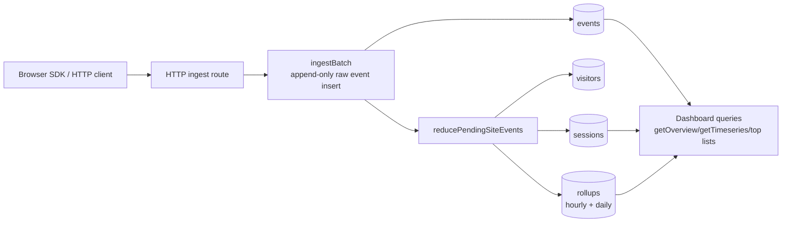

# Convex Analytics [](https://www.convex.dev/components/abdssamie/convex-analytics)
Un componente de análisis de productos en tiempo real y de primera parte para Convex. Rastrea vistas de página, eventos personalizados e identidad de usuario directamente en tu propia base de datos: no se requieren servicios de terceros.

- **Ingestión en tiempo real**: Punto final HTTP de alta velocidad para la recepción de eventos.
- **Panel listo para usar**: Un componente React completo con gráficos de series temporales y métricas.
- **Datos de primera parte**: Tú eres el dueño de los datos; permanecen en tu despliegue de Convex.
- **SDK para navegador**: Cliente pequeño, sin dependencias y con agrupación automática.

## Inicio rápido

### Antes de comenzar: una clave de escritura, dos lugares

Genera una clave de escritura para tu sitio.

Usarás esa misma clave sin procesar en dos lugares:

- en el servidor al crear el sitio
- en el navegador al enviar solicitudes de ingesta

Variables de entorno sugeridas:

- Variable de entorno de Convex: `ANALYTICS_WRITE_KEY`
- variable de entorno del frontend: `NEXT_PUBLIC_ANALYTICS_WRITE_KEY` o `VITE_ANALYTICS_WRITE_KEY`

Si esos dos valores no coinciden, los eventos no se ingerirán.

### 1. Instala el componente de Convex

```sh
npm install @abdssamie/convex-analytics
```

```ts
import { defineApp } from "convex/server";
import convexAnalytics from "@abdssamie/convex-analytics/convex.config.js";

const app = defineApp();
app.use(convexAnalytics, { httpPrefix: "/analytics-component/" });

export default app;
```

### 2. Registra la ruta de ingesta

```ts
// convex/http.ts
import { httpRouter } from "convex/server";
import { components } from "./_generated/api";
import { registerRoutes } from "@abdssamie/convex-analytics";

const http = httpRouter();

registerRoutes(http, components.convexAnalytics);

export default http;
```

Si `components.convexAnalytics` falta, inicia tu servidor de desarrollo de Convex primero para que existan los enlaces del componente generados:

```sh
npx convex dev
```

### 3. Crea el sitio predeterminado una vez

Crea una pequeña mutación de arranque:

```ts
// convex/analytics.ts
import { components } from "./_generated/api";
import { provisionSite } from "@abdssamie/convex-analytics";

export const provisionDefaultSite = provisionSite(components.convexAnalytics, {
  auth: async () => {},
  site: {
    slug: "default",
    name: "Default site",
    writeKey: process.env.ANALYTICS_WRITE_KEY!,
    allowedOrigins: [], // Don't forget allowed origins here to protect your service if key gets leaked
  },
});
```

Luego ejecútalo una vez:

```sh
npx convex run analytics:provisionDefaultSite
```

`provisionDefaultSite` es idempotente. Si `default` ya existe, no se romperá nada.
También falla rápidamente si la variable de entorno de la clave de escritura de analíticas falta o está vacía.

### 4. Envía eventos desde el navegador

```ts
import { createAnalytics } from "@abdssamie/convex-analytics";

const analytics = createAnalytics({
  endpoint: "https://your-deployment.convex.site/analytics/ingest",
  writeKey: process.env.NEXT_PUBLIC_ANALYTICS_WRITE_KEY!,
  autoPageviews: false,
});

analytics.page();
analytics.track("signup_clicked", { plan: "pro" });
analytics.identify("user_123", { tier: "pro" });
```

Eso es suficiente para comenzar a enviar analíticas.

Si tu aplicación no empaqueta módulos de npm, puedes cargar el rastreador con una etiqueta script básica en lugar de importar `createAnalytics(...)` directamente.

Inicialización automática con una etiqueta script:

```html
<script
  defer
  src="https://unpkg.com/@abdssamie/convex-analytics@latest/dist/embed/convex-analytics.js"
  data-endpoint="https://your-deployment.convex.site/analytics/ingest"
  data-write-key="write_..."
  data-auto-pageviews="true"
></script>
```

O inicialízalo manualmente:

```html
<script src="https://unpkg.com/@abdssamie/convex-analytics@latest/dist/embed/convex-analytics.js"></script>
<script>
  window.ConvexAnalytics.init({
    endpoint: "https://your-deployment.convex.site/analytics/ingest",
    writeKey: "write_...",
    autoPageviews: false,
  });

  window.ConvexAnalytics.page();
</script>
```

Globales disponibles en el navegador:

- `window.ConvexAnalytics.init(...)`
- `window.ConvexAnalytics.page(...)`
- `window.ConvexAnalytics.track(...)`
- `window.ConvexAnalytics.identify(...)`
- `window.ConvexAnalytics.flush()`

### 5. Renderiza el panel

Una vez configurados el componente y el sitio `default`, expone la API de lectura desde tu backend de Convex y protégela con autenticación.

### Backend: expone las consultas del panel

```ts
// convex/analytics.ts
import { components } from "./_generated/api";
import {
  exposeAdminApi,
  exposeAnalyticsApi,
} from "@abdssamie/convex-analytics";

const auth = async (ctx: { auth: { getUserIdentity: () => Promise<unknown> } }) => {
  const identity = await ctx.auth.getUserIdentity();
  if (!identity) {
    throw new Error("Unauthorized");
  }
};

export const { getSiteBySlug } = exposeAdminApi(components.convexAnalytics, {
  auth: async (ctx) => auth(ctx),
});

export const {
  getDashboardSummary,
  getOverview,
  getTimeseries,
  getTopPages,
  getTopReferrers,
  getTopSources,
  getTopMediums,
  getTopCampaigns,
  getTopEvents,
  getTopDevices,
  getTopBrowsers,
  getTopOs,
  getTopCountries,
  listRawEvents,
  listPageviews,
  listSessions,
  listVisitors,
} = exposeAnalyticsApi(components.convexAnalytics, {
  auth: async (ctx, operation) => {
    await auth(ctx);
    // Add your own site ownership check here for operation.siteId.
  },
});
```

### Frontend: renderiza el panel

```tsx
import { AnalyticsDashboard } from "@abdssamie/convex-analytics/react";
import { useQuery } from "convex/react";
import { api } from "../convex/_generated/api";

export function DashboardPage() {
  const site = useQuery(api.analytics.getSiteBySlug, { slug: "default" });

  if (site === undefined) {
    return <div>Loading...</div>;
  }

  if (site === null) {
    return <div>Default analytics site not found.</div>;
  }

  return (
    <AnalyticsDashboard
      siteId={site._id}
      api={{
        getDashboardSummary: api.analytics.getDashboardSummary,
        getOverview: api.analytics.getOverview,
        getTimeseries: api.analytics.getTimeseries,
        getTopPages: api.analytics.getTopPages,
        getTopReferrers: api.analytics.getTopReferrers,
        getTopSources: api.analytics.getTopSources,
        getTopMediums: api.analytics.getTopMediums,
        getTopCampaigns: api.analytics.getTopCampaigns,
        getTopEvents: api.analytics.getTopEvents,
        getTopDevices: api.analytics.getTopDevices,
        getTopBrowsers: api.analytics.getTopBrowsers,
        getTopOs: api.analytics.getTopOs,
        getTopCountries: api.analytics.getTopCountries,
        listRawEvents: api.analytics.listRawEvents,
        listPageviews: api.analytics.listPageviews,
        listSessions: api.analytics.listSessions,
        listVisitors: api.analytics.listVisitors,
      }}
    />
  );
}
```

El panel en sí no maneja la autenticación. La autenticación corresponde a tus envolturas de backend, y el componente React solo lee desde esas consultas autenticadas.

El componente almacena solo `writeKeyHash`, no la clave de escritura sin procesar.

La clave de escritura del navegador es una credencial de ingesta, no un secreto administrativo. Trátala como una clave publicable: hazla larga y aleatoria, restringe `allowedOrigins` y ruédala si se filtra.

## Qué Rastrea

- Vistas de página
- Eventos de producto personalizados
- Visitantes anónimos
- Sesiones
- Enlaces de `identify(userId, traits)`
- Referentes y campos de campaña UTM
- Principales páginas, eventos, referentes y campañas
- Informes de resumen y series temporales

## Arquitectura

El componente posee sus propias tablas de Convex:

- `sites`: un sitio/aplicación rastreada por clave de escritura
- `visitors`: registros duraderos de visitantes anónimos
- `sessions`: ventanas de sesión y resumen general de dispositivo/navegador/país
- `events`: eventos crudos de solo escritura con marcador ligero de agregación
- `rollups`: contadores de informes por hora/día



Por qué existe `sites`: un despliegue de Convex puede rastrear múltiples sitios o aplicaciones.
Para el caso común de un solo sitio, crea un sitio llamado `default` e ignora las partes multisitio hasta que sean necesarias.

El tráfico del navegador debe usar la ruta de ingesta HTTP. No envíes cada evento del navegador a través de mutaciones públicas de Convex. El SDK agrupa eventos y la ruta HTTP enmascara (hash) la clave de escritura antes de llamar al componente.

La ingesta y los informes están separados a propósito. `ingestBatch` escribe eventos crudos rápidamente, deja `aggregatedAt: null` y programa la agregación en segundo plano. El trabajador materializa visitantes, sesiones y rollups, luego marca `aggregatedAt`.

Las consultas del panel son conscientes del rango:

- las consultas de resumen y de dimensiones principales usan manejo exacto de bordes
- el primer/último cubo de series temporales se recorta al rango solicitado
- los eventos crudos pueden retrasarse por el tiempo del trabajador, generalmente unos pocos segundos

## Solución de problemas

### El navegador muestra un error de CORS en `/analytics/ingest`

Ejemplo:

```text
Access to fetch at 'https://your-deployment.convex.site/analytics/ingest'
from origin 'http://localhost:3001' has been blocked by CORS policy:
No 'Access-Control-Allow-Origin' header is present on the requested resource.
```

Verifica esto primero:

- el navegador está usando la misma clave de escritura que usaste en `provisionDefaultSite`
- el sitio se creó correctamente
- el origen actual está permitido para ese sitio

Por qué parece CORS:

- la ruta de ingesta verifica la clave de escritura y el sitio antes de devolver los encabezados CORS
- si esa verificación falla, el navegador a menudo informa un error genérico de CORS

Soluciones útiles:

```sh
npx convex run analytics:provisionDefaultSite
```

- verifica que tu variable de entorno del frontend coincida con `ANALYTICS_WRITE_KEY`
- verifica que `allowedOrigins` incluya tu dominio local o de producción

### `components.convexAnalytics` falta

Ejecuta tu servidor de desarrollo de Convex primero para que existan los enlaces del componente generados:

```sh
npx convex dev
```

### El panel indica que no se encontró el sitio predeterminado

Registraste el componente y las consultas, pero el registro del sitio aún no existe.
Ejecuta:

```sh
npx convex run analytics:provisionDefaultSite
```

## API del Panel

Cuando quieras leer analíticas en tu aplicación, expone solo las funciones de lectura:

```ts
// convex/analytics.ts
import { components } from "./_generated/api";
import { exposeAnalyticsApi } from "@abdssamie/convex-analytics";

export const {
  getDashboardSummary,
  getOverview,
  getTimeseries,
  getEventPropertyBreakdown,
  getTopPages,
  getTopReferrers,
  getTopSources,
  getTopMediums,
  getTopCampaigns,
  getTopEvents,
  getTopDevices,
  getTopBrowsers,
  getTopOs,
  getTopCountries,
  listRawEvents,
  listPageviews,
  listSessions,
  listVisitors,
} = exposeAnalyticsApi(components.convexAnalytics, {
  auth: async (ctx, operation) => {
    const identity = await ctx.auth.getUserIdentity();
    if (!identity) {
      throw new Error("Unauthorized");
    }
    // Add your own site ownership check here for operation.siteId.
  },
});
```

Métodos disponibles:

- `getDashboardSummary(siteId, from, to, interval)`
- `getOverview(siteId, from, to)`
- `getTimeseries(siteId, from, to, interval)`
- `getEventPropertyBreakdown(siteId, eventName, propertyKey, from, to, limit?)`
- `getTopPages(siteId, from, to, limit?)`
- `getTopReferrers(siteId, from, to, limit?)`
- `getTopSources(siteId, from, to, limit?)`
- `getTopMediums(siteId, from, to, limit?)`
- `getTopCampaigns(siteId, from, to, limit?)`
- `getTopEvents(siteId, from, to, limit?)`
- `getTopDevices(siteId, from, to, limit?)`
- `getTopBrowsers(siteId, from, to, limit?)`
- `getTopOs(siteId, from, to, limit?)`
- `getTopCountries(siteId, from, to, limit?)`
- `listRawEvents(siteId, from?, to?, paginationOpts)`
- `listPageviews(siteId, from?, to?, paginationOpts)`
- `listSessions(siteId, from?, to?, paginationOpts)`
- `listVisitors(siteId, from?, to?, paginationOpts)`

## Avanzado: API de Administración de Sitios

No necesitas esto para la instalación inicial.

Usa `exposeAdminApi(...)` solo si tu aplicación necesita gestión de sitios:

```ts
import { components } from "./_generated/api";
import { exposeAdminApi } from "@abdssamie/convex-analytics";

export const {
  createSite,
  updateSite,
  rotateWriteKey,
  cleanupSite,
} = exposeAdminApi(components.convexAnalytics, {
  auth: async (ctx, operation) => {
    // admin auth / site ownership check here
  },
});
```

Funciones administrativas:

- `createSite`, `updateSite`, `rotateWriteKey`
- `cleanupSite(siteId? | slug?, now?, limit?, runUntilComplete?)`

Estructura recomendada para el panel:

1. `getOverview` para tarjetas KPI
2. `getTimeseries` para gráficos
3. consultas de dimensiones principales para tablas
4. `getEventPropertyBreakdown` para análisis ágil de eventos de producto
5. `listRawEvents` / `listPageviews` / `listSessions` / `listVisitors` para análisis detallado y depuración

Ejemplo de consulta de analíticas de producto:

```ts
await ctx.runQuery(api.analytics.getEventPropertyBreakdown, {
  siteId,
  eventName: "plan_selected",
  propertyKey: "plan",
  from,
  to,
  limit: 10,
});
```

Nomenclatura recomendada para eventos:

- `track("plan_selected", { plan: "pro" })`
- `track("checkout_started", { step: "shipping" })`
- `identify(userId, { plan: "pro" })`

Las consultas de análisis detallado devuelven objetos de paginación de Convex:

- `page`
- `isDone`
- `continueCursor`

Los eventos crudos son la fuente de verdad de solo escritura. Los rollups son la capa de servicio.

## Retención

La retención se configura por sitio. Los valores predeterminados están optimizados para costos:

- eventos crudos `events`: 90 días
- `rollups` por hora: 90 días
- `rollups` diarios: se mantienen indefinidamente

`retentionDays` es el valor predeterminado compartido para eventos crudos y rollups por hora. Anula campos específicos cuando sea necesario:

```ts
registerRoutes(http, components.convexAnalytics, {
  path: "/analytics/ingest",
  countryLookup: "headers-only",
});
```

## Avanzado: Limpieza y Retención

La limpieza es explícita para que controles el volumen de solicitudes y los costos. Para la mayoría de las aplicaciones, agrega una acción de limpieza y un cron y deja de preocuparte por ello.

Si deseas programaciones personalizadas, esta es la forma manual:

```ts
// convex/cleanup.ts
import { components } from "./_generated/api";
import { internalAction } from "./_generated/server";
import { v } from "convex/values";

export const site = internalAction({
  args: {
    slug: v.string(),
    limit: v.optional(v.number()),
  },
  handler: async (ctx, args) => {
    return await ctx.runAction(components.convexAnalytics.maintenance.cleanupSite, {
      slug: args.slug,
      limit: args.limit,
    });
  },
});
```

Luego programa las tareas:

```ts
// convex/crons.ts
import { cronJobs } from "convex/server";
import { internal } from "./_generated/api";

const crons = cronJobs();

crons.interval(
  "analytics cleanup",
  { hours: 6 },
  internal.cleanup.site,
  { slug: "default", limit: 100 },
);

export default crons;
```

Estas son funciones administrativas. No las llames desde clientes de navegador.

Usa `runUntilComplete: true` solo para backfills puntuales o después de una interrupción. Para crones de producción normales, déjalo sin establecer y permite que cada ejecución elimine un lote acotado.

## SDK de React Native

Instala AsyncStorage junto con este paquete:

```sh
npm install @react-native-async-storage/async-storage
```

Luego usa el punto de entrada de React Native:

```ts
import { createRnAnalytics } from "@abdssamie/convex-analytics/react-native";
import AsyncStorage from "@react-native-async-storage/async-storage";

const analytics = await createRnAnalytics({
  endpoint: "https://your-deployment.convex.site/analytics/ingest",
  writeKey: process.env.ANALYTICS_WRITE_KEY!,
  storage: AsyncStorage,
});

analytics.track("screen_view", { screen: "Home" });
analytics.identify("user_123", { tier: "pro" });
```

El SDK de React Native usa el mismo motor de ingesta que el SDK del navegador.
La única diferencia es la capa de almacenamiento: en lugar de `localStorage`/`sessionStorage`, usa `@react-native-async-storage/async-storage` (o cualquier proveedor de almacenamiento compatible).

### Proveedor de almacenamiento personalizado

Si prefieres un backend de almacenamiento diferente, pasa cualquier objeto que implemente `getItem` y `setItem`:

```ts
const analytics = await createRnAnalytics({
  endpoint: "...",
  writeKey: "...",
  storage: {
    getItem: (key: string) => Promise<string | null>,
    setItem: (key: string, value: string) => Promise<void>,
  },
});
```

### Vistas de página automáticas

A diferencia del SDK del navegador, el SDK de React Native no rastrea vistas de página automáticamente.
Llama a `analytics.track("screen_view", { screen: "Home" })` en eventos de navegación:

```ts
import { useNavigation } from "@react-navigation/native";

function App() {
  const navigation = useNavigation();

  useEffect(() => {
    const unsubscribe = navigation.addListener("state", () => {
      const route = navigation.getCurrentRoute();
      if (route) {
        analytics.track("screen_view", { screen: route.name });
      }
    });
    return unsubscribe;
  }, [navigation]);
}
```

## SDK del Navegador

Usa el asistente del navegador en tu frontend:

```ts
import { createAnalytics } from "@abdssamie/convex-analytics";

const analytics = createAnalytics({
  endpoint: "https://your-deployment.convex.site/analytics/ingest",
  writeKey: "write_...",
  autoPageviews: false,
  flushIntervalMs: 5000,
  maxBatchSize: 10,
});

analytics.page();
analytics.track("signup_clicked", { plan: "pro" });
analytics.identify("user_123", { tier: "pro" });
await analytics.flush();
```

El SDK almacena:

- `visitorId` en `localStorage`
- `sessionId` en `sessionStorage`
- eventos en cola solo en memoria

Se vacía según intervalo, tamaño de lote y `pagehide`.

Para React Native, consulta la sección [SDK de React Native](#react-native-sdk) a continuación.

`autoPageviews: true` funciona para cargas completas de página tradicionales. Para SPAs, llama a `analytics.page()` en los cambios de ruta tú mismo:

```ts
useEffect(() => {
  analytics.page();
}, [analytics, pathname]);
```

## Controles de Costo

La ruta de ingesta predeterminada está diseñada para evitar un uso innecesario de Convex:

- Los eventos del navegador se agrupan.
- Los eventos crudos son ligeros.
- Las claves de escritura se enmascaran (hash) antes de llegar al almacenamiento del componente.
- La ingesta no actualiza contadores de informes en línea.
- Los informes usan rollups por hora/día para consultas comunes de analíticas.
- La limpieza usa lotes acotados e indexados y mantiene rollups diarios por defecto.
- Las propiedades de los eventos se pueden permitir o denegar por sitio.
- Las direcciones IP crudas no se persisten por este componente.

## Nota

Aunque este componente ha sido optimizado para reducir el costo de uso de Convex, si tienes muchos usuarios o esperas tenerlos, considera otro servicio, ya que convex-analytics no ha sido probado para uso a gran escala, pero la mayoría de los desarrolladores no tendrán que preocuparse por esto.

## Publicación

Scripts de lanzamiento:

- `npm run alpha`
- `npm run release`
- `npm run verify:release`

Ambos pasan por `preversion`, que ejecuta:

- `npm ci`
- `npm run build:clean`
- `npm run test`
- `npm run lint`
- `npm run typecheck`

`npm run verify:release` agrega `npm pack` encima, coincidiendo con CI.

El script `version` del paquete ahora es no interactivo. Solo formatea `CHANGELOG.md` y lo prepara si es necesario.

Automatización de GitHub Actions:

- `CI` se ejecuta en cada push a `main`, solicitud de extracción y despach manual.
- `Publish` se ejecuta en etiquetas `v*` y despach manual.
- `Publish` requiere un secreto de repositorio `NPM_TOKEN`.
- La publicación basada en etiquetas verifica que `vX.Y.Z` coincida con la versión `X.Y.Z` de `package.json`.

## Desarrollo

```sh
npm install
npm run build:codegen
npm test
npm run typecheck
```

Ejecuta la aplicación de ejemplo:

```sh
npm run dev
npm run dev:frontend
```

El frontend de ejemplo es una pequeña aplicación de producto que envía eventos de analíticas. No es un panel. Usa el panel de Convex para inspeccionar tablas del componente, funciones y eventos almacenados.
