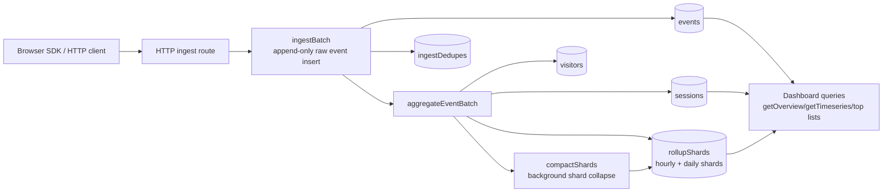

# Convex Analytics

A Convex component for first-party product and web analytics. It stores events
directly in your Convex deployment, with browser batching, anonymous visitors,
sessions, raw event history, and async rollup-backed reports.

This component is designed for apps that want Rybbit-style core analytics
without running a separate analytics service.

## What It Tracks

- Pageviews
- Custom product events
- Anonymous visitors
- Sessions
- `identify(userId, traits)` links
- Referrers and UTM campaign fields
- Top pages, events, referrers, and campaigns
- Overview and timeseries reports

## Architecture

The component owns its own Convex tables:

- `sites`: one tracked site/app per write key
- `visitors`: durable anonymous visitor records
- `sessions`: session windows and coarse device/source summary
- `events`: append-only raw events with lightweight aggregation marker
- `rollupShards`: sharded hourly/daily report counters
- `ingestDedupes`: short-lived retry/idempotency cache



Why `sites` exists: one Convex deployment can track multiple sites or apps.
For the common one-site case, create one site named `default` and ignore the
multi-site parts until needed.

Browser traffic should use HTTP ingest route. Do not send every browser event
through public Convex mutations. SDK batches events and HTTP route hashes write
key before calling component.

Ingest and reporting are split on purpose. `ingestBatch` writes raw events
quickly, leaves `aggregatedAt: null`, and schedules background aggregation. The
worker materializes visitors, sessions, and rollup shards, then stamps
`aggregatedAt`. Compaction later collapses old shard fanout back to shard `0`
so dashboard queries stay cheap.

Dashboard queries are range-aware:

- overview and top-dimension queries use exact edge handling
- first/last timeseries bucket is clipped to requested range
- raw events can lag by worker time, usually a few seconds

## Installation

Install the component in `convex/convex.config.ts`:

```ts
import { defineApp } from "convex/server";
import convexAnalytics from "@Abdssamie/convex-analytics/convex.config.js";

const app = defineApp();
app.use(convexAnalytics, { httpPrefix: "/analytics-component/" });

export default app;
```

Create site once from backend/admin code, then register HTTP ingest route in
`convex/http.ts`. Browser callers cannot create or modify sites.

```ts
// convex/example.ts
import { components } from "./_generated/api";
import { exposeAdminApi } from "@Abdssamie/convex-analytics";

export const { createSite } = exposeAdminApi(components.convexAnalytics, {
  auth: async () => {},
});
```

Run `createSite(...)` one time per tracked site. After that, ingest route only
accepts events for already-created sites.

For quick example/demo setup, expose tiny bootstrap mutation and run it once:

```ts
export const setupDefaultSite = mutation({
  args: {},
  handler: async (ctx) => {
    return await ctx.runMutation(components.convexAnalytics.sites.createSite, {
      slug: "default",
      name: "Default site",
      writeKeyHash: await hashWriteKey(process.env.ANALYTICS_WRITE_KEY!),
      allowedOrigins: [],
    });
  },
});
```

```sh
npx convex run example:setupDefaultSite
```

```ts
import { httpRouter } from "convex/server";
import { components } from "./_generated/api";
import { registerRoutes } from "@Abdssamie/convex-analytics";

const http = httpRouter();

registerRoutes(http, components.convexAnalytics, {
  path: "/analytics/ingest",
});

export default http;
```

Add default maintenance wrappers once:

```ts
// convex/cleanup.ts
import { components } from "./_generated/api";
import { internalMutation } from "./_generated/server";
import { v } from "convex/values";
import {
  runCleanupSite,
  runPruneExpired,
} from "@Abdssamie/convex-analytics";

export const site = internalMutation({
  args: {
    siteId: v.optional(v.string()),
    slug: v.optional(v.string()),
    now: v.optional(v.number()),
    limit: v.optional(v.number()),
    runUntilComplete: v.optional(v.boolean()),
  },
  handler: async (ctx, args) => {
    return await runCleanupSite(ctx, components.convexAnalytics, args);
  },
});

export const dedupes = internalMutation({
  args: {
    now: v.optional(v.number()),
    limit: v.optional(v.number()),
  },
  handler: async (ctx, args) => {
    return await runPruneExpired(ctx, components.convexAnalytics, args);
  },
});
```

Then register default crons:

```ts
// convex/crons.ts
import { cronJobs } from "convex/server";
import { internal } from "./_generated/api";
import { registerDefaultAnalyticsCrons } from "@Abdssamie/convex-analytics";

const crons = cronJobs();

registerDefaultAnalyticsCrons(
  crons,
  {
    cleanupSite: internal.cleanup.site,
    pruneExpired: internal.cleanup.dedupes,
  },
  {
    slug: "default",
  },
);

export default crons;
```

That is enough for normal installs.

For multiple sites on same Convex deployment, call `createSite(...)` once for
each site with separate write keys and origins.

Component stores only `writeKeyHash`, not raw write keys.

The browser write key is an ingest credential, not an admin secret. Treat it like
a publishable key: make it long and random, restrict `allowedOrigins`, and rotate
it if leaked.

Expose report/admin wrappers only if your app needs them:

```ts
import { components } from "./_generated/api";
import { exposeAnalyticsApi } from "@Abdssamie/convex-analytics";

export const {
  getOverview,
  getTimeseries,
  getTopPages,
  getTopReferrers,
  getTopSources,
  getTopMediums,
  getTopCampaigns,
  getTopEvents,
  listRawEvents,
  listSessions,
} = exposeAnalyticsApi(components.convexAnalytics, {
  auth: async (ctx, operation) => {
    const identity = await ctx.auth.getUserIdentity();
    if (!identity) {
      throw new Error("Unauthorized");
    }
    // Add your own site ownership check here for operation.siteId.
  },
});
```

## Dashboard API

`exposeApi(...)` gives installers ergonomic app-facing wrappers around component
functions. For dashboard/read-only app surface, use `exposeAnalyticsApi(...)`.

Dashboard surface:

- `getOverview(siteId, from, to)`
- `getTimeseries(siteId, from, to, interval)`
- `getTopPages(siteId, from, to, limit?)`
- `getTopReferrers(siteId, from, to, limit?)`
- `getTopSources(siteId, from, to, limit?)`
- `getTopMediums(siteId, from, to, limit?)`
- `getTopCampaigns(siteId, from, to, limit?)`
- `getTopEvents(siteId, from, to, limit?)`
- `listRawEvents(siteId, from?, to?, paginationOpts)`
- `listSessions(siteId, from?, to?, paginationOpts)`

Admin/repair functions exist too, but they are separate from dashboard reads.
Use `exposeAdminApi(...)` only in backend/admin modules:

```ts
import { components } from "./_generated/api";
import { exposeAdminApi } from "@Abdssamie/convex-analytics";

export const {
  createSite,
  updateSite,
  rotateWriteKey,
  cleanupSite,
  pruneExpired,
} = exposeAdminApi(components.convexAnalytics, {
  auth: async (ctx, operation) => {
    // admin auth / site ownership check here
  },
});
```

Admin surface:

- `createSite`, `updateSite`, `rotateWriteKey`
- `cleanupSite(siteId? | slug?, now?, limit?, runUntilComplete?)`
- `pruneExpired(now?, limit?)`

Recommended dashboard shape:

1. `getOverview` for KPI cards
2. `getTimeseries` for chart
3. top-dimension queries for tables
4. `listRawEvents` and `listSessions` for drill-down/debug

Both drill-down queries return Convex pagination objects:

- `page`
- `isDone`
- `continueCursor`

Raw events are append-only source of truth. Rollups are serving layer.

## Retention

Retention is configured per site. Defaults are cost-conscious:

- raw `events`: 90 days
- hourly `rollupShards`: 90 days
- daily `rollupShards`: kept indefinitely
- `ingestDedupes`: 24 hours from insertion

`retentionDays` is shared default for raw events and hourly rollups. Override
specific fields when needed:

```ts
registerRoutes(http, components.convexAnalytics, {
  path: "/analytics/ingest",
});
```

Cleanup is explicit so you control request volume and billing. For most apps,
use the default helper above and stop thinking about it.

If you want custom schedules, this is the manual shape:

```ts
// convex/cleanup.ts
import { components } from "./_generated/api";
import { internalMutation } from "./_generated/server";
import { v } from "convex/values";

export const site = internalMutation({
  args: {
    slug: v.string(),
    limit: v.optional(v.number()),
  },
  handler: async (ctx, args) => {
    return await ctx.runMutation(components.convexAnalytics.maintenance.cleanupSite, {
      slug: args.slug,
      limit: args.limit,
    });
  },
});

export const dedupes = internalMutation({
  args: { limit: v.optional(v.number()) },
  handler: async (ctx, args) => {
    return await ctx.runMutation(
      components.convexAnalytics.maintenance.pruneExpired,
      args,
    );
  },
});
```

Then schedule them:

```ts
// convex/crons.ts
import { cronJobs } from "convex/server";
import { internal } from "./_generated/api";

const crons = cronJobs();

crons.interval(
  "analytics cleanup",
  { hours: 6 },
  internal.cleanup.site,
  { slug: "default", limit: 100 },
);

crons.interval(
  "analytics dedupe cleanup",
  { hours: 6 },
  internal.cleanup.dedupes,
  { limit: 100 },
);

export default crons;
```

These are admin functions. Do not call them from browser clients.

Use `runUntilComplete: true` only for one-off backfills or after downtime. For
normal production cron, keep it unset and let each run delete a bounded batch.

## Browser SDK

Use the browser helper in your frontend:

```ts
import { createAnalytics } from "@Abdssamie/convex-analytics";

const analytics = createAnalytics({
  endpoint: "https://your-deployment.convex.site/analytics/ingest",
  writeKey: "write_...",
  autoPageviews: true,
  flushIntervalMs: 5000,
  maxBatchSize: 10,
});

analytics.track("signup_clicked", { plan: "pro" });
analytics.identify("user_123", { tier: "pro" });
await analytics.flush();
```

The SDK stores:

- `visitorId` in `localStorage`
- `sessionId` in `sessionStorage`
- queued events in memory only

It flushes on interval, batch size, and `pagehide`.

## Cost Controls

The default ingest path is built to avoid unnecessary Convex usage:

- Browser events are batched.
- Raw events are slim.
- Write keys are hashed before reaching component storage.
- Retry dedupe prevents duplicate event inserts.
- Ingest does not patch report counters inline.
- Reports use sharded hourly/daily rollups for common analytics queries.
- Old rollup shard fanout is compacted in background.
- Cleanup uses indexed, bounded batches and keeps daily rollups by default.
- Event properties can be allowlisted or denied per site.
- Raw IP addresses are not persisted by this component.

## Development

```sh
npm install
npm run build:codegen
npm test
npm run typecheck
```

Run the example app:

```sh
npm run dev
npm run dev:frontend
```

The example frontend is a small product app that sends analytics events. It is
not a dashboard. Use the Convex dashboard to inspect component tables,
functions, and stored events.
