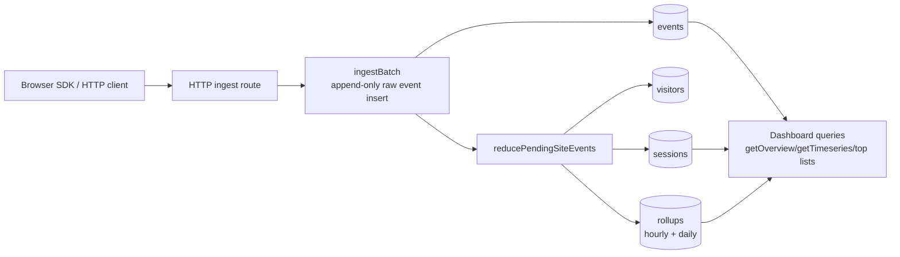

# Convex Analytics [](https://www.convex.dev/components/abdssamie/convex-analytics)
A first-party, real-time product analytics component for Convex. Track pageviews, custom events, and user identity directly into your own database—no third-party services required.

- **Real-time Ingestion**: High-speed HTTP endpoint for event landing.
- **Drop-in Dashboard**: A complete React component with timeseries charts and metrics.
- **First-party Data**: You own the data; it stays in your Convex deployment.
- **Browser SDK**: Tiny, dependency-free client with auto-batching.

## Quick Start

### Before you start: one write key, two places

Generate one write key for your site.

You will use that same raw key in two places:

- server-side when creating the site
- browser-side when sending ingest requests

Suggested env vars:

- Convex env: `ANALYTICS_WRITE_KEY`
- frontend env: `NEXT_PUBLIC_ANALYTICS_WRITE_KEY` or `VITE_ANALYTICS_WRITE_KEY`

If those two values do not match, events will not be ingested.

### 1. Install the Convex component

```sh
npm install @abdssamie/convex-analytics
```

```ts
import { defineApp } from "convex/server";
import convexAnalytics from "@abdssamie/convex-analytics/convex.config.js";

const app = defineApp();
app.use(convexAnalytics, { httpPrefix: "/analytics-component/" });

export default app;
```

### 2. Register the ingest route

```ts
// convex/http.ts
import { httpRouter } from "convex/server";
import { components } from "./_generated/api";
import { registerRoutes } from "@abdssamie/convex-analytics";

const http = httpRouter();

registerRoutes(http, components.convexAnalytics);

export default http;
```

If `components.convexAnalytics` is missing, start your Convex dev server first
so generated component bindings exist:

```sh
npx convex dev
```

### 3. Create the default site once

Create a tiny bootstrap mutation:

```ts
// convex/analytics.ts
import { components } from "./_generated/api";
import { provisionSite } from "@abdssamie/convex-analytics";

export const provisionDefaultSite = provisionSite(components.convexAnalytics, {
  auth: async () => {},
  site: {
    slug: "default",
    name: "Default site",
    writeKey: process.env.ANALYTICS_WRITE_KEY!,
    allowedOrigins: [], // Don't forget allowed origins here to protect your service if key gets leaked
  },
});
```

Then run it once:

```sh
npx convex run analytics:provisionDefaultSite
```

`provisionDefaultSite` is idempotent. If `default` already exists, nothing breaks.
It also fails fast if your analytics write key env var is missing or empty.

### 4. Send events from the browser

```ts
import { createAnalytics } from "@abdssamie/convex-analytics";

const analytics = createAnalytics({
  endpoint: "https://your-deployment.convex.site/analytics/ingest",
  writeKey: process.env.NEXT_PUBLIC_ANALYTICS_WRITE_KEY!,
  autoPageviews: false,
});

analytics.page();
analytics.track("signup_clicked", { plan: "pro" });
analytics.identify("user_123", { tier: "pro" });
```

That is enough to start sending analytics.

If your app is not bundling npm modules, you can load the tracker with a plain
script tag instead of importing `createAnalytics(...)` directly.

Auto-init with one script tag:

```html
<script
  defer
  src="https://unpkg.com/@abdssamie/convex-analytics@latest/dist/embed/convex-analytics.js"
  data-endpoint="https://your-deployment.convex.site/analytics/ingest"
  data-write-key="write_..."
  data-auto-pageviews="true"
></script>
```

Or initialize it manually:

```html
<script src="https://unpkg.com/@abdssamie/convex-analytics@latest/dist/embed/convex-analytics.js"></script>
<script>
  window.ConvexAnalytics.init({
    endpoint: "https://your-deployment.convex.site/analytics/ingest",
    writeKey: "write_...",
    autoPageviews: false,
  });

  window.ConvexAnalytics.page();
</script>
```

Available browser globals:

- `window.ConvexAnalytics.init(...)`
- `window.ConvexAnalytics.page(...)`
- `window.ConvexAnalytics.track(...)`
- `window.ConvexAnalytics.identify(...)`
- `window.ConvexAnalytics.flush()`

### 5. Render the dashboard

After the component and `default` site are set up, expose the read API from
your Convex backend and protect it with auth.

### Backend: expose dashboard queries

```ts
// convex/analytics.ts
import { components } from "./_generated/api";
import {
  exposeAdminApi,
  exposeAnalyticsApi,
} from "@abdssamie/convex-analytics";

const auth = async (ctx: { auth: { getUserIdentity: () => Promise<unknown> } }) => {
  const identity = await ctx.auth.getUserIdentity();
  if (!identity) {
    throw new Error("Unauthorized");
  }
};

export const { getSiteBySlug } = exposeAdminApi(components.convexAnalytics, {
  auth: async (ctx) => auth(ctx),
});

export const {
  getDashboardSummary,
  getOverview,
  getTimeseries,
  getTopPages,
  getTopReferrers,
  getTopSources,
  getTopMediums,
  getTopCampaigns,
  getTopEvents,
  getTopDevices,
  getTopBrowsers,
  getTopOs,
  getTopCountries,
  listRawEvents,
  listPageviews,
  listSessions,
  listVisitors,
} = exposeAnalyticsApi(components.convexAnalytics, {
  auth: async (ctx, operation) => {
    await auth(ctx);
    // Add your own site ownership check here for operation.siteId.
  },
});
```

### Frontend: render the dashboard

```tsx
import { AnalyticsDashboard } from "@abdssamie/convex-analytics/react";
import { useQuery } from "convex/react";
import { api } from "../convex/_generated/api";

export function DashboardPage() {
  const site = useQuery(api.analytics.getSiteBySlug, { slug: "default" });

  if (site === undefined) {
    return <div>Loading...</div>;
  }

  if (site === null) {
    return <div>Default analytics site not found.</div>;
  }

  return (
    <AnalyticsDashboard
      siteId={site._id}
      api={{
        getDashboardSummary: api.analytics.getDashboardSummary,
        getOverview: api.analytics.getOverview,
        getTimeseries: api.analytics.getTimeseries,
        getTopPages: api.analytics.getTopPages,
        getTopReferrers: api.analytics.getTopReferrers,
        getTopSources: api.analytics.getTopSources,
        getTopMediums: api.analytics.getTopMediums,
        getTopCampaigns: api.analytics.getTopCampaigns,
        getTopEvents: api.analytics.getTopEvents,
        getTopDevices: api.analytics.getTopDevices,
        getTopBrowsers: api.analytics.getTopBrowsers,
        getTopOs: api.analytics.getTopOs,
        getTopCountries: api.analytics.getTopCountries,
        listRawEvents: api.analytics.listRawEvents,
        listPageviews: api.analytics.listPageviews,
        listSessions: api.analytics.listSessions,
        listVisitors: api.analytics.listVisitors,
      }}
    />
  );
}
```

The dashboard itself does not handle authentication. Auth belongs in your
backend wrappers, and the React component reads only from those authenticated
queries.

Component stores only `writeKeyHash`, not the raw write key.

The browser write key is an ingest credential, not an admin secret. Treat it like
a publishable key: make it long and random, restrict `allowedOrigins`, and rotate
it if leaked.

## What It Tracks

- Pageviews
- Custom product events
- Anonymous visitors
- Sessions
- `identify(userId, traits)` links
- Referrers and UTM campaign fields
- Top pages, events, referrers, and campaigns
- Overview and timeseries reports

## Architecture

The component owns its own Convex tables:

- `sites`: one tracked site/app per write key
- `visitors`: durable anonymous visitor records
- `sessions`: session windows and coarse device/browser/country summary
- `events`: append-only raw events with lightweight aggregation marker
- `rollups`: hourly/daily report counters



Why `sites` exists: one Convex deployment can track multiple sites or apps.
For the common one-site case, create one site named `default` and ignore the
multi-site parts until needed.

Browser traffic should use HTTP ingest route. Do not send every browser event
through public Convex mutations. SDK batches events and HTTP route hashes write
key before calling component.

Ingest and reporting are split on purpose. `ingestBatch` writes raw events
quickly, leaves `aggregatedAt: null`, and schedules background aggregation. The
worker materializes visitors, sessions, and rollups, then stamps
`aggregatedAt`.

Dashboard queries are range-aware:

- overview and top-dimension queries use exact edge handling
- first/last timeseries bucket is clipped to requested range
- raw events can lag by worker time, usually a few seconds

## Troubleshooting

### Browser shows a CORS error on `/analytics/ingest`

Example:

```text
Access to fetch at 'https://your-deployment.convex.site/analytics/ingest'
from origin 'http://localhost:3001' has been blocked by CORS policy:
No 'Access-Control-Allow-Origin' header is present on the requested resource.
```

Check these first:

- the browser is using the same write key you used in `provisionDefaultSite`
- the site was created successfully
- the current origin is allowed for that site

Why this looks like CORS:

- the ingest route checks the write key and site before returning CORS headers
- if that check fails, the browser often reports a generic CORS error

Useful fixes:

```sh
npx convex run analytics:provisionDefaultSite
```

- verify your frontend env var matches `ANALYTICS_WRITE_KEY`
- verify `allowedOrigins` includes your local or production domain

### `components.convexAnalytics` is missing

Run your Convex dev server first so generated component bindings exist:

```sh
npx convex dev
```

### Dashboard says the default site is not found

You registered the component and queries, but the site record does not exist yet.
Run:

```sh
npx convex run analytics:provisionDefaultSite
```

## Dashboard API

When you want to read analytics in your app, expose only the read functions:

```ts
// convex/analytics.ts
import { components } from "./_generated/api";
import { exposeAnalyticsApi } from "@abdssamie/convex-analytics";

export const {
  getDashboardSummary,
  getOverview,
  getTimeseries,
  getEventPropertyBreakdown,
  getTopPages,
  getTopReferrers,
  getTopSources,
  getTopMediums,
  getTopCampaigns,
  getTopEvents,
  getTopDevices,
  getTopBrowsers,
  getTopOs,
  getTopCountries,
  listRawEvents,
  listPageviews,
  listSessions,
  listVisitors,
} = exposeAnalyticsApi(components.convexAnalytics, {
  auth: async (ctx, operation) => {
    const identity = await ctx.auth.getUserIdentity();
    if (!identity) {
      throw new Error("Unauthorized");
    }
    // Add your own site ownership check here for operation.siteId.
  },
});
```

Dashboard surface:

- `getDashboardSummary(siteId, from, to, interval)`
- `getOverview(siteId, from, to)`
- `getTimeseries(siteId, from, to, interval)`
- `getEventPropertyBreakdown(siteId, eventName, propertyKey, from, to, limit?)`
- `getTopPages(siteId, from, to, limit?)`
- `getTopReferrers(siteId, from, to, limit?)`
- `getTopSources(siteId, from, to, limit?)`
- `getTopMediums(siteId, from, to, limit?)`
- `getTopCampaigns(siteId, from, to, limit?)`
- `getTopEvents(siteId, from, to, limit?)`
- `getTopDevices(siteId, from, to, limit?)`
- `getTopBrowsers(siteId, from, to, limit?)`
- `getTopOs(siteId, from, to, limit?)`
- `getTopCountries(siteId, from, to, limit?)`
- `listRawEvents(siteId, from?, to?, paginationOpts)`
- `listPageviews(siteId, from?, to?, paginationOpts)`
- `listSessions(siteId, from?, to?, paginationOpts)`
- `listVisitors(siteId, from?, to?, paginationOpts)`

## Advanced: Site Admin API

You do not need this for the initial install.

Use `exposeAdminApi(...)` only if your app needs site management:

```ts
import { components } from "./_generated/api";
import { exposeAdminApi } from "@abdssamie/convex-analytics";

export const {
  createSite,
  updateSite,
  rotateWriteKey,
  cleanupSite,
} = exposeAdminApi(components.convexAnalytics, {
  auth: async (ctx, operation) => {
    // admin auth / site ownership check here
  },
});
```

Admin surface:

- `createSite`, `updateSite`, `rotateWriteKey`
- `cleanupSite(siteId? | slug?, now?, limit?, runUntilComplete?)`

Recommended dashboard shape:

1. `getOverview` for KPI cards
2. `getTimeseries` for chart
3. top-dimension queries for tables
4. `getEventPropertyBreakdown` for lean product-event analysis
5. `listRawEvents` / `listPageviews` / `listSessions` / `listVisitors` for drill-down/debug

Example product analytics query:

```ts
await ctx.runQuery(api.analytics.getEventPropertyBreakdown, {
  siteId,
  eventName: "plan_selected",
  propertyKey: "plan",
  from,
  to,
  limit: 10,
});
```

Recommended event naming:

- `track("plan_selected", { plan: "pro" })`
- `track("checkout_started", { step: "shipping" })`
- `identify(userId, { plan: "pro" })`

Drill-down queries return Convex pagination objects:

- `page`
- `isDone`
- `continueCursor`

Raw events are append-only source of truth. Rollups are serving layer.

## Retention

Retention is configured per site. Defaults are cost-conscious:

- raw `events`: 90 days
- hourly `rollups`: 90 days
- daily `rollups`: kept indefinitely

`retentionDays` is shared default for raw events and hourly rollups. Override
specific fields when needed:

```ts
registerRoutes(http, components.convexAnalytics, {
  path: "/analytics/ingest",
  countryLookup: "headers-only",
});
```

## Advanced: Cleanup and Retention

Cleanup is explicit so you control request volume and billing. For most apps,
add one cleanup action and one cron and stop thinking about it.

If you want custom schedules, this is the manual shape:

```ts
// convex/cleanup.ts
import { components } from "./_generated/api";
import { internalAction } from "./_generated/server";
import { v } from "convex/values";

export const site = internalAction({
  args: {
    slug: v.string(),
    limit: v.optional(v.number()),
  },
  handler: async (ctx, args) => {
    return await ctx.runAction(components.convexAnalytics.maintenance.cleanupSite, {
      slug: args.slug,
      limit: args.limit,
    });
  },
});
```

Then schedule them:

```ts
// convex/crons.ts
import { cronJobs } from "convex/server";
import { internal } from "./_generated/api";

const crons = cronJobs();

crons.interval(
  "analytics cleanup",
  { hours: 6 },
  internal.cleanup.site,
  { slug: "default", limit: 100 },
);

export default crons;
```

These are admin functions. Do not call them from browser clients.

Use `runUntilComplete: true` only for one-off backfills or after downtime. For
normal production cron, keep it unset and let each run delete a bounded batch.

## Browser SDK

Use the browser helper in your frontend:

```ts
import { createAnalytics } from "@abdssamie/convex-analytics";

const analytics = createAnalytics({
  endpoint: "https://your-deployment.convex.site/analytics/ingest",
  writeKey: "write_...",
  autoPageviews: false,
  flushIntervalMs: 5000,
  maxBatchSize: 10,
});

analytics.page();
analytics.track("signup_clicked", { plan: "pro" });
analytics.identify("user_123", { tier: "pro" });
await analytics.flush();
```

The SDK stores:

- `visitorId` in `localStorage`
- `sessionId` in `sessionStorage`
- queued events in memory only

It flushes on interval, batch size, and `pagehide`.

`autoPageviews: true` works for traditional full-page loads. For SPAs, call
`analytics.page()` on route changes yourself:

```ts
useEffect(() => {
  analytics.page();
}, [analytics, pathname]);
```

## Cost Controls

The default ingest path is built to avoid unnecessary Convex usage:

- Browser events are batched.
- Raw events are slim.
- Write keys are hashed before reaching component storage.
- Ingest does not patch report counters inline.
- Reports use hourly/daily rollups for common analytics queries.
- Cleanup uses indexed, bounded batches and keeps daily rollups by default.
- Event properties can be allowlisted or denied per site.
- Raw IP addresses are not persisted by this component.

## Note

While this component has been optimized to reduce convex usage cost, if you 
have many users or except to do so, then consider another service 
as convex-analytics hasn't been tested for large scale usage, but most 
developers don't have to bother about this.

## Publishing

Release scripts:

- `npm run alpha`
- `npm run release`
- `npm run verify:release`

Both go through `preversion`, which runs:

- `npm ci`
- `npm run build:clean`
- `npm run test`
- `npm run lint`
- `npm run typecheck`

`npm run verify:release` adds `npm pack` on top, matching CI.

The package `version` script is non-interactive now. It just formats
`CHANGELOG.md` and stages it if needed.

GitHub Actions automation:

- `CI` runs on every push to `main`, pull request, and manual dispatch.
- `Publish` runs on `v*` tags and manual dispatch.
- `Publish` requires an `NPM_TOKEN` repository secret.
- Tag-based publish verifies that `vX.Y.Z` matches `package.json` version `X.Y.Z`.

## Development

```sh
npm install
npm run build:codegen
npm test
npm run typecheck
```

Run the example app:

```sh
npm run dev
npm run dev:frontend
```

The example frontend is a small product app that sends analytics events. It is
not a dashboard. Use the Convex dashboard to inspect component tables,
functions, and stored events.
