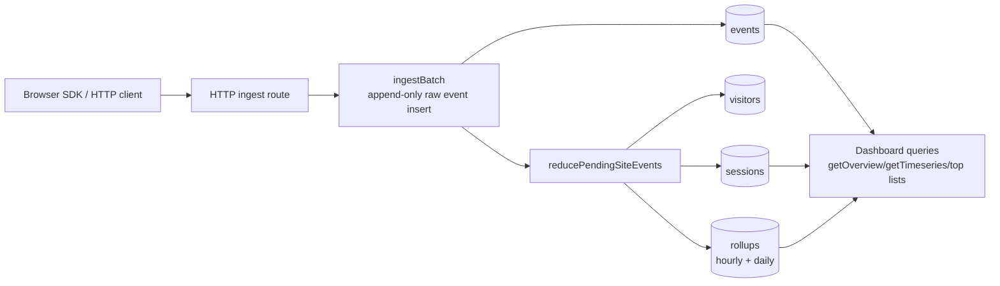

# Convex Analytics

A Convex component for first-party product and web analytics. It stores events
directly in your Convex deployment, with browser batching, anonymous visitors,
sessions, raw event history, and async rollup-backed reports.

This component is designed for apps that want Rybbit-style core analytics
without running a separate analytics service.

## What It Tracks

- Pageviews
- Custom product events
- Anonymous visitors
- Sessions
- `identify(userId, traits)` links
- Referrers and UTM campaign fields
- Top pages, events, referrers, and campaigns
- Overview and timeseries reports

## Architecture

The component owns its own Convex tables:

- `sites`: one tracked site/app per write key
- `visitors`: durable anonymous visitor records
- `sessions`: session windows and coarse device/browser/country summary
- `events`: append-only raw events with lightweight aggregation marker
- `rollups`: hourly/daily report counters



Why `sites` exists: one Convex deployment can track multiple sites or apps.
For the common one-site case, create one site named `default` and ignore the
multi-site parts until needed.

Browser traffic should use HTTP ingest route. Do not send every browser event
through public Convex mutations. SDK batches events and HTTP route hashes write
key before calling component.

Ingest and reporting are split on purpose. `ingestBatch` writes raw events
quickly, leaves `aggregatedAt: null`, and schedules background aggregation. The
worker materializes visitors, sessions, and rollups, then stamps
`aggregatedAt`.

Dashboard queries are range-aware:

- overview and top-dimension queries use exact edge handling
- first/last timeseries bucket is clipped to requested range
- raw events can lag by worker time, usually a few seconds

## Installation

Install the component in `convex/convex.config.ts`:

```ts
import { defineApp } from "convex/server";
import convexAnalytics from "@abdssamie/convex-analytics/convex.config.js";

const app = defineApp();
app.use(convexAnalytics, { httpPrefix: "/analytics-component/" });

export default app;
```

Recommended app integration: keep the pieces separate, but use a tiny
idempotent provisioning helper for the default site so you do not have to wire
`getSiteBySlug` and `createSite` manually.

```ts
// convex/analytics.ts
import { components } from "./_generated/api";
import {
  exposeAdminApi,
  exposeAnalyticsApi,
  provisionSite,
} from "@abdssamie/convex-analytics";

const auth = async (ctx: { auth: { getUserIdentity: () => Promise<unknown> } }) => {
  const identity = await ctx.auth.getUserIdentity();
  if (!identity) {
    throw new Error("Unauthorized");
  }
  // Add your own site ownership / admin checks here when needed.
};

export const provisionDefaultSite = provisionSite(components.convexAnalytics, {
  auth: async (ctx) => auth(ctx),
  site: {
    slug: "default",
    name: "Default site",
    writeKey: process.env.ANALYTICS_WRITE_KEY!,
    allowedOrigins: [],
  },
});

export const {
  getDashboardSummary,
  getOverview,
  getTimeseries,
  getEventPropertyBreakdown,
  getTopPages,
  getTopReferrers,
  getTopSources,
  getTopMediums,
  getTopCampaigns,
  getTopEvents,
  getTopDevices,
  getTopBrowsers,
  getTopOs,
  getTopCountries,
  listRawEvents,
  listPageviews,
  listSessions,
  listVisitors,
} = exposeAnalyticsApi(components.convexAnalytics, {
  auth: async (ctx, operation) => {
    await auth(ctx);
    // Add site ownership checks here for operation.siteId.
  },
});

export const {
  createSite,
  updateSite,
  rotateWriteKey,
  getSiteBySlug,
  cleanupSite,
} = exposeAdminApi(components.convexAnalytics, {
  auth: async (ctx) => auth(ctx),
});
```

Add default maintenance wrappers once:

```ts
// convex/cleanup.ts
import { components } from "./_generated/api";
import { internalAction } from "./_generated/server";
import { v } from "convex/values";
import { runCleanupSite } from "@abdssamie/convex-analytics";

export const site = internalAction({
  args: {
    siteId: v.optional(v.string()),
    slug: v.optional(v.string()),
    now: v.optional(v.number()),
    limit: v.optional(v.number()),
    runUntilComplete: v.optional(v.boolean()),
  },
  handler: async (ctx, args) => {
    return await runCleanupSite(ctx, components.convexAnalytics, args);
  },
});
```

Then register default crons:

```ts
// convex/crons.ts
import { cronJobs } from "convex/server";
import { internal } from "./_generated/api";
import { registerDefaultAnalyticsCrons } from "@abdssamie/convex-analytics";

const crons = cronJobs();

registerDefaultAnalyticsCrons(
  crons,
  {
    cleanupSite: internal.cleanup.site,
  },
  {
    slug: "default",
  },
);

export default crons;
```

Register the ingest route directly:

```ts
// convex/http.ts
import { httpRouter } from "convex/server";
import { components } from "./_generated/api";
import { registerRoutes } from "@abdssamie/convex-analytics";

const http = httpRouter();

registerRoutes(http, components.convexAnalytics);

export default http;
```

Create the site once during setup or deployment:

```sh
npx convex run analytics:provisionDefaultSite
```

That is enough for normal installs.
Default helper runs bounded cleanup batches on each cron tick. Use
`runUntilComplete: true` only for explicit backfills or catch-up work.

`provisionDefaultSite` is idempotent: if the `default` site already exists, it
returns the existing site instead of trying to create it again.

For multiple sites on same Convex deployment, use `createSite(...)`
for additional slugs with separate write keys and origins.

Component stores only `writeKeyHash`, not raw write keys.

The browser write key is an ingest credential, not an admin secret. Treat it like
a publishable key: make it long and random, restrict `allowedOrigins`, and rotate
it if leaked.

If you prefer fully manual wiring, the low-level wrappers are still available:

```ts
import { components } from "./_generated/api";
import { exposeAnalyticsApi } from "@abdssamie/convex-analytics";

export const {
  getDashboardSummary,
  getOverview,
  getTimeseries,
  getEventPropertyBreakdown,
  getTopPages,
  getTopReferrers,
  getTopSources,
  getTopMediums,
  getTopCampaigns,
  getTopEvents,
  getTopDevices,
  getTopBrowsers,
  getTopOs,
  getTopCountries,
  listRawEvents,
  listPageviews,
  listSessions,
  listVisitors,
} = exposeAnalyticsApi(components.convexAnalytics, {
  auth: async (ctx, operation) => {
    const identity = await ctx.auth.getUserIdentity();
    if (!identity) {
      throw new Error("Unauthorized");
    }
    // Add your own site ownership check here for operation.siteId.
  },
});
```

## Dashboard API

Recommended pieces:

- `provisionSite(...)` for one idempotent site bootstrap mutation
- `registerRoutes(...)` for HTTP ingest
- `exposeAnalyticsApi(...)` for read/dashboard wrappers
- `exposeAdminApi(...)` for admin/repair wrappers

If you want lower-level control, `exposeApi(...)` gives app-facing wrappers
around component functions, and `exposeAnalyticsApi(...)` gives the read-only
dashboard surface.

Dashboard surface:

- `getDashboardSummary(siteId, from, to, interval)`
- `getOverview(siteId, from, to)`
- `getTimeseries(siteId, from, to, interval)`
- `getEventPropertyBreakdown(siteId, eventName, propertyKey, from, to, limit?)`
- `getTopPages(siteId, from, to, limit?)`
- `getTopReferrers(siteId, from, to, limit?)`
- `getTopSources(siteId, from, to, limit?)`
- `getTopMediums(siteId, from, to, limit?)`
- `getTopCampaigns(siteId, from, to, limit?)`
- `getTopEvents(siteId, from, to, limit?)`
- `getTopDevices(siteId, from, to, limit?)`
- `getTopBrowsers(siteId, from, to, limit?)`
- `getTopOs(siteId, from, to, limit?)`
- `getTopCountries(siteId, from, to, limit?)`
- `listRawEvents(siteId, from?, to?, paginationOpts)`
- `listPageviews(siteId, from?, to?, paginationOpts)`
- `listSessions(siteId, from?, to?, paginationOpts)`
- `listVisitors(siteId, from?, to?, paginationOpts)`

Admin/repair functions exist too, but they are separate from dashboard reads.
Use `exposeAdminApi(...)` only in backend/admin modules:

```ts
import { components } from "./_generated/api";
import { exposeAdminApi } from "@abdssamie/convex-analytics";

export const {
  createSite,
  updateSite,
  rotateWriteKey,
  cleanupSite,
} = exposeAdminApi(components.convexAnalytics, {
  auth: async (ctx, operation) => {
    // admin auth / site ownership check here
  },
});
```

Admin surface:

- `createSite`, `updateSite`, `rotateWriteKey`
- `cleanupSite(siteId? | slug?, now?, limit?, runUntilComplete?)`

Recommended dashboard shape:

1. `getOverview` for KPI cards
2. `getTimeseries` for chart
3. top-dimension queries for tables
4. `getEventPropertyBreakdown` for lean product-event analysis
5. `listRawEvents` / `listPageviews` / `listSessions` / `listVisitors` for drill-down/debug

Example product analytics query:

```ts
await ctx.runQuery(api.analytics.getEventPropertyBreakdown, {
  siteId,
  eventName: "plan_selected",
  propertyKey: "plan",
  from,
  to,
  limit: 10,
});
```

Recommended event naming:

- `track("plan_selected", { plan: "pro" })`
- `track("checkout_started", { step: "shipping" })`
- `identify(userId, { plan: "pro" })`

Drill-down queries return Convex pagination objects:

- `page`
- `isDone`
- `continueCursor`

Raw events are append-only source of truth. Rollups are serving layer.

## Retention

Retention is configured per site. Defaults are cost-conscious:

- raw `events`: 90 days
- hourly `rollups`: 90 days
- daily `rollups`: kept indefinitely

`retentionDays` is shared default for raw events and hourly rollups. Override
specific fields when needed:

```ts
registerRoutes(http, components.convexAnalytics, {
  path: "/analytics/ingest",
  countryLookup: "headers-only",
});
```

Cleanup is explicit so you control request volume and billing. For most apps,
use the default helper above and stop thinking about it.

If you want custom schedules, this is the manual shape:

```ts
// convex/cleanup.ts
import { components } from "./_generated/api";
import { internalAction } from "./_generated/server";
import { v } from "convex/values";

export const site = internalAction({
  args: {
    slug: v.string(),
    limit: v.optional(v.number()),
  },
  handler: async (ctx, args) => {
    return await ctx.runAction(components.convexAnalytics.maintenance.cleanupSite, {
      slug: args.slug,
      limit: args.limit,
    });
  },
});
```

Then schedule them:

```ts
// convex/crons.ts
import { cronJobs } from "convex/server";
import { internal } from "./_generated/api";

const crons = cronJobs();

crons.interval(
  "analytics cleanup",
  { hours: 6 },
  internal.cleanup.site,
  { slug: "default", limit: 100 },
);

export default crons;
```

These are admin functions. Do not call them from browser clients.

Use `runUntilComplete: true` only for one-off backfills or after downtime. For
normal production cron, keep it unset and let each run delete a bounded batch.

## Browser SDK

Use the browser helper in your frontend:

```ts
import { createAnalytics } from "@abdssamie/convex-analytics";

const analytics = createAnalytics({
  endpoint: "https://your-deployment.convex.site/analytics/ingest",
  writeKey: "write_...",
  autoPageviews: false,
  flushIntervalMs: 5000,
  maxBatchSize: 10,
});

analytics.page();
analytics.track("signup_clicked", { plan: "pro" });
analytics.identify("user_123", { tier: "pro" });
await analytics.flush();
```

The SDK stores:

- `visitorId` in `localStorage`
- `sessionId` in `sessionStorage`
- queued events in memory only

It flushes on interval, batch size, and `pagehide`.

`autoPageviews: true` works for traditional full-page loads. For SPAs, call
`analytics.page()` on route changes yourself:

```ts
useEffect(() => {
  analytics.page();
}, [analytics, pathname]);
```

## Cost Controls

The default ingest path is built to avoid unnecessary Convex usage:

- Browser events are batched.
- Raw events are slim.
- Write keys are hashed before reaching component storage.
- Ingest does not patch report counters inline.
- Reports use hourly/daily rollups for common analytics queries.
- Cleanup uses indexed, bounded batches and keeps daily rollups by default.
- Event properties can be allowlisted or denied per site.
- Raw IP addresses are not persisted by this component.
- Country enrichment is header-only by default. Third-party lookup is opt-in.

## Publishing

Release scripts:

- `npm run alpha`
- `npm run release`
- `npm run verify:release`

Both go through `preversion`, which runs:

- `npm ci`
- `npm run build:clean`
- `npm run test`
- `npm run lint`
- `npm run typecheck`

`npm run verify:release` adds `npm pack` on top, matching CI.

The package `version` script is non-interactive now. It just formats
`CHANGELOG.md` and stages it if needed.

GitHub Actions automation:

- `CI` runs on every push to `main`, pull request, and manual dispatch.
- `Publish` runs on `v*` tags and manual dispatch.
- `Publish` requires an `NPM_TOKEN` repository secret.
- Tag-based publish verifies that `vX.Y.Z` matches `package.json` version `X.Y.Z`.

## Development

```sh
npm install
npm run build:codegen
npm test
npm run typecheck
```

Run the example app:

```sh
npm run dev
npm run dev:frontend
```

The example frontend is a small product app that sends analytics events. It is
not a dashboard. Use the Convex dashboard to inspect component tables,
functions, and stored events.
